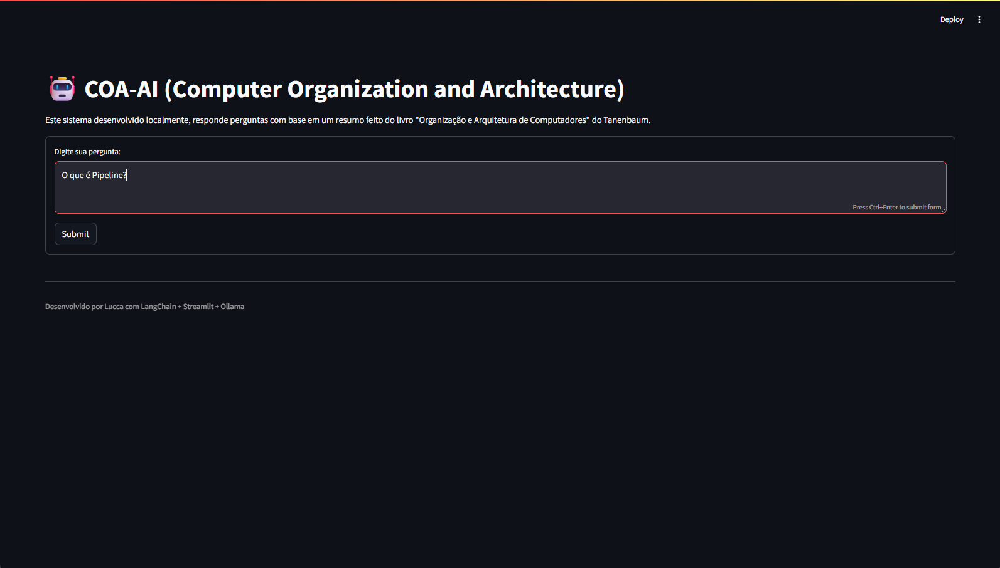
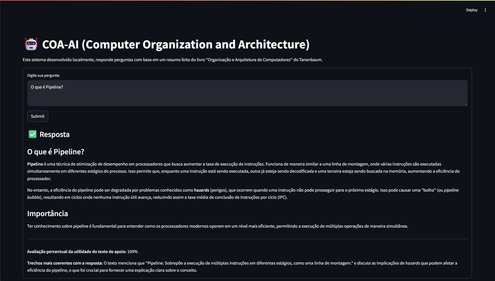

# Sistema de Consultas Inteligentes com RAG 🧠🔍
- Este projeto implementa um sistema baseado em RAG (Retrieval-Augmented Generation), com o objetivo de auxiliar alunos da disciplina Organização e Arquitetura de Computadores. A solução utiliza técnicas de processamento de linguagem natural para responder perguntas com base em materiais de estudo previamente indexados, promovendo uma experiência de aprendizado mais interativa e eficiente.

## 📚 Base de Conhecimento
- Os documentos utilizados no sistema são fragmentos do livro Arquitetura e Organização de Computadores de William Stallings, organizados e vetorizados com divisão semântica via RecursiveCharacterTextSplitter.


## 📷 Imagens da Plataforma
### 1. Menu de Consulta:
Interface simples para digitação da pergunta e visualização do resultado.

</img>


### 2. Exemplo de Consulta:
Pergunta feita pelo usuário e resposta gerada com base no conteúdo vetorizado.

</img>

## 🧑‍💻 Sobre o Projeto
- Parte de um projeto realizado por uma dupla de alunos cursando o 3º período do curso de Ciência da Computação, na disciplina optativa Ciência de Dados – 2025.1:

1. Leonardo Lucas de Brito Silva
2. Lucca de Sena Barbosa

- O objetivo do projeto é aplicar, na prática, os conceitos de RAG (Retrieval-Augmented Generation) para resolver um problema real de aprendizado, tornando o conteúdo da disciplina mais acessível por meio da IA.

## ⚠ Observações
- As respostas são geradas com base nos documentos fornecidos, não devendo substituir o estudo completo da disciplina.

- Projeto experimental para fins educacionais.

## 🚀 Como Executar o Projeto
Clone o repositório:

```bash
git clone https://github.com/luccasena/Rag-System.git
```

Crie o ambiente virtual:

```bash
py -m venv venv
```

Ative o ambiente virtual:

```bash
venv/Scripts/activate
```

Instale as dependências:

```bash
pip install -r requirements.txt
```

Execute a aplicação:

```bash
streamlit run app.py
```